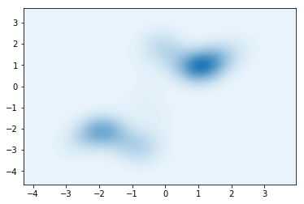
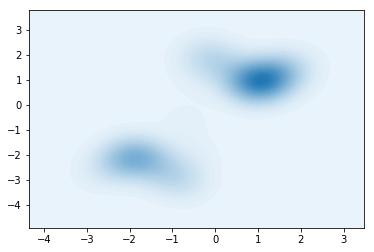
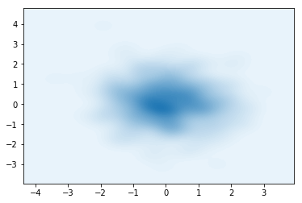
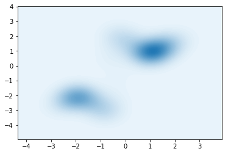

# Normalizing flows in Pyro

We want to approximate some target density $p(\mathbf{x},\mathbf{z})$ with an approximate distribution $q$. To do so,
let $\varepsilon\sim q(\varepsilon)$, and let $\{f_i\}_{i=1}^N$ be a set of $N$ invertible functions (*normalizing flows*). We repeatedly apply function composition such as 
$$
\varepsilon \mapsto f_1 \circ \varepsilon \mapsto ... \mapsto f_N \circ ... \circ f_1 \circ \varepsilon,
$$
which defines a variational distribution $q(\mathbf{z}\lvert\mathbf{x})$.

The optimization problem consists in finding the optimal $f_1,..,f_N$ such as to maximize the ELBO:
$$
\mathcal{L}=\mathbb{E}_{\varepsilon}[p(\mathbf{x},\mathbf{z})-q(\mathbf{z}|\mathbf{x})]
$$

Here, we assume that $p(\mathbf{x},\mathbf{z})$ is exactly known as `p_z`, which gets passed as an argument to both the model and the guide. It is used to score samples from $q(\mathbf{z}\lvert\mathbf{x})$.

**Model**: $p(\mathbf{x},\mathbf{z})$, has to be from `torch.distributions` or extended by Pyro transforms.

**Guide**: $q(\mathbf{z}\lvert \mathbf{x})$, the variational approximation to the true posterior. This is the NF.


```python
from pyro.nn import AutoRegressiveNN
from pyro import distributions
import pyro, torch
import numpy as np
import matplotlib.pyplot as plt
from pyro.optim import Adam
from pyro.infer import SVI, Trace_ELBO
%matplotlib inline

from torch.distributions.multivariate_normal import MultivariateNormal as mvn
import seaborn as sns

import torch.nn as nn

torch.manual_seed(0)
np.random.seed(0)

class NormalizingFlow(nn.Module):
    def __init__(self,dim,
                      n_flows,
                     base_dist=lambda dim:distributions.Normal(torch.zeros(dim), torch.ones(dim)),
                     flow_type=lambda kwargs:distributions.transforms.RadialFlow(**kwargs),
                     args={'flow_args':{'dim':2}}):
        super(NormalizingFlow, self).__init__()
        self.dim = dim
        self.n_flows = n_flows
        self.base_dist = base_dist(dim)
        
        
        """
        If the flow needs an autoregressive net, build it for every flow
        """
        if 'arn_hidden' in args:
            self.arns = nn.ModuleList([AutoRegressiveNN(dim,
                                                        args['arn_hidden'],
                                                        param_dims=[self.dim]*args['n_params']) for _ in range(n_flows)])
    
        """
        Initialize all flows
        """
        self.nfs = []
        for f in range(n_flows):
            if 'autoregressive_nn' in args['flow_args']:
                args['flow_args']['autoregressive_nn'] = self.arns[f]
            nf = flow_type(args['flow_args'])
            self.nfs.append(nf)

        """
        This step assumes that nfs={f_i}_{i=1}^N and that base_dist=N(0,I)
        Then, register the (biejctive) transformation Z=nfs(eps), eps~base_dist
        """
        self.nf_dist = distributions.TransformedDistribution(self.base_dist, self.nfs)
        
        self._register()
        
    def _register(self):
        """
        Register all N flows with Pyro
        """
        for f in range(self.n_flows):
            nf_module = pyro.module("nf_%d" %(f), self.nfs[f])

    def target(self,x,p_z):
        """
        p(x,z), but x is not required if there is a true density function (p_z in this case)
        
        1. Sample Z ~ p_z
        2. Score it's likelihood against p_z
        """
        with pyro.plate("data", x.shape[0]):
            p = p_z()
            z = pyro.sample("latent",p)
            pyro.sample("obs", p, obs=x.reshape(-1, self.dim))
        
    def model(self,x,p_z):
        """
        q(z|x), once again x is not required
        
        1. Sample Z ~ nfs(eps), eps ~ N(0,I)
        
        This is the NN being trained
        """
        self._register()
        with pyro.plate("data", x.shape[0]):
            pyro.sample("latent", self.nf_dist)

    def sample(self,n):
        """
        Sample a batch of (n,dim)
        
        Bug: in IAF and IAFStable, the dimensions throw an error (todo)
        """
        return self.nf_dist.sample(torch.Size([n]))
    
    def log_prob(self,z):
        """
        Returns log q(z|x) for z (assuming no x is required)
        """
        return self.nf_dist.log_prob(z)
```

The above class simply allows to combine multiple NF layers (of the same kind/hyperparameters). However, it would be possible to mix, say, affine layers with radial and followed by IAF.

We define the default parameters for the most commonly used flows:
- NAF
- Planar
- Radial
- Householder
- Sylvester

Note that IAF and Polynomial flows don't work out of the box as of now (dimension mismatch issues).


```python
flow = distributions.transforms.SylvesterFlow
base_dist = lambda dim:distributions.Normal(torch.zeros(dim), torch.ones(dim))
dim = 2
n_flows = 3

if 'InverseAutoregressiveFlow' in flow.__name__:
    args = {'arn_hidden':[64],
            'n_params': 2,
            'flow_args':{'autoregressive_nn':None}
            }
elif flow.__name__ == 'NeuralAutoregressive':
    args = {'arn_hidden':[64],
                 'n_params': 3,
                 'flow_args':{'hidden_units':64,'autoregressive_nn':None}
           }
elif flow.__name__ == 'PolynomialFlow':
    args = {'arn_hidden':[64],
                 'n_params': 2,
                 'flow_args':{'input_dim':dim,'autoregressive_nn':None,'count_sum':3,'count_degree':1}
           }
elif flow.__name__ == 'PlanarFlow':
    args = {'flow_args':{'input_dim':dim}}
elif flow.__name__ == 'RadialFlow':
    args = {'flow_args':{'input_dim':dim}}
elif flow.__name__ in ['HouseholderFlow']:
    args = {'flow_args':{'input_dim':dim,
                         'count_transforms':2}}
elif flow.__name__ in ['SylvesterFlow']:
    args = {'flow_args':{'input_dim':dim,
                         'count_transforms':2}}
else:
    raise('Flow not found')
    
nf_obj = NormalizingFlow(dim=dim,
                      n_flows=n_flows,
                     base_dist=base_dist,
                     flow_type=lambda kwargs:flow(**kwargs),
                     args=args)
```

The normalizing flow model is initialized randomly (probably Kaimin). 

We can sample $\varepsilon \sim \mathcal{N}(0,I)$ and then pass it through an untrained NF to visualize the output.


```python
samples = nf_obj.sample(1000).numpy()

sns.kdeplot(data=samples[:,0],data2=samples[:,1],n_levels=60, shade=True)
plt.show()
```





Now that the model is built, we can define a target density to fit. For example, a mixture of Gaussians defined by:

$$
\begin{cases}
j \sim \text{Cat}([0.5,0.5])\\
Z \sim \mathcal{N}(\mu_j,\Sigma_j)
\end{cases},
$$
where
$$
\mu_1 = (1,1), \Sigma_1 = (1,1),\\
\mu_2 = (-2,-2), \Sigma_2 = (1,1)
$$

The method `p_z` returns the `torch.distributions` object instead of samples, since this allows to compute the log-likelihood of parameters as well as entropy, etc. 


```python
def p_z(mu1=torch.FloatTensor([1,1]),mu2=torch.FloatTensor([-2,-2])):

    Sigma1 = torch.FloatTensor([1,1])
    Sigma2 = torch.FloatTensor([1,1])
    component_logits = torch.FloatTensor([0.5,0.5]) # mixture weights
    
    dist = distributions.MixtureOfDiagNormals(locs=torch.stack([mu1,mu2],axis=0),
                                       coord_scale=torch.stack([Sigma1,Sigma2],axis=0),
                                       component_logits=component_logits)
    return dist

def plot_density(density):

    X_LIMS = (-7, 7)
    Y_LIMS = (-7, 7)

    x1 = np.linspace(*X_LIMS, 300)
    x2 = np.linspace(*Y_LIMS, 300)
    x1, x2 = np.meshgrid(x1, x2)
    shape = x1.shape
    x1 = x1.ravel()
    x2 = x2.ravel()

    z = np.c_[x1, x2]
    z = torch.FloatTensor(z)
    
    density_values = density(z).data.numpy().reshape(shape)

    fig = plt.figure(figsize=(7, 7))
    ax = fig.add_subplot(111)
    ax.contour(density_values, extent=(*X_LIMS, *Y_LIMS), cmap="viridis")
    plt.show()
    
plot_density(lambda z:p_z().log_prob(z).exp())
```


Now that both $q(\mathbf{z}|\mathbf{x})$ and $p(\mathbf{x},\mathbf{z})$ are defined, we can start training the guide wrt to it's NF parameters.


```python
adam_params = {"lr": 0.005, "betas": (0.90, 0.999)}
optimizer = Adam(adam_params)

# setup the inference algorithm
svi = SVI(nf_obj.target, nf_obj.model, optimizer, loss=Trace_ELBO())
n_steps = 2000 # number of batches
dist = p_z() # true distribution
# do gradient steps
losses = []
for step in range(n_steps):
    data = dist.rsample(torch.Size([128])) # using a batch of 128 new data points every step
    loss = svi.step(data,p_z) # analogous to opt.step() in PyTorch
    losses.append(loss)
    if step % 100 == 0:
        print(loss)
```

    571.4546508789062
    448.7998352050781
    343.52020263671875
    282.6593933105469
    263.49713134765625
    249.08203125
    228.95071411132812
    219.81777954101562
    190.34423828125
    188.39773559570312
    201.866943359375
    197.57135009765625
    184.26498413085938
    183.40689086914062
    176.41812133789062
    174.1444091796875
    156.29306030273438
    160.69271850585938
    172.19161987304688
    151.59783935546875


After training, we can once again visualize the samples from the (now trained) guide $q(\mathbf{z}|\mathbf{x})$


```python
samples = nf_obj.sample(500).numpy()

sns.kdeplot(data=samples[:,0],data2=samples[:,1],n_levels=60, shade=True)
plt.show()
```





We can also visualize the outputs of intermediate flows $f_1,...,f_{N-1}$


```python
for f in range(n_flows+1):
    intermediate_nf = distributions.TransformedDistribution(nf_obj.base_dist, nf_obj.nfs[:f])

    samples = intermediate_nf.sample(torch.Size([500])).numpy()

    sns.kdeplot(data=samples[:,0],data2=samples[:,1],n_levels=60, shade=True)
    plt.show()
```








# Applications

NFs (or more generally, invertible neural networks) have been used in:
- Generative models with $1\times1$ invertible convolutions [Link to paper](https://arxiv.org/abs/1807.03039)
- Reinforcement learning, to improve upon the (not always optimal) Gaussian policy [Link to paper](https://arxiv.org/abs/1905.06893)
- Simulating attraction-repulsion forces in actor-critic [Link to paper](https://arxiv.org/abs/1909.07543)
